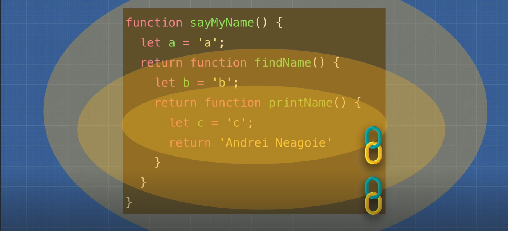
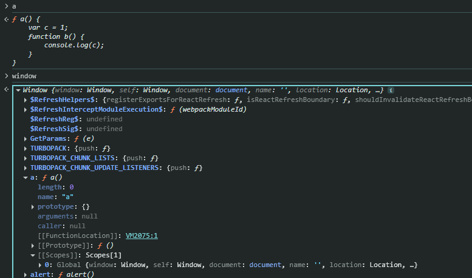
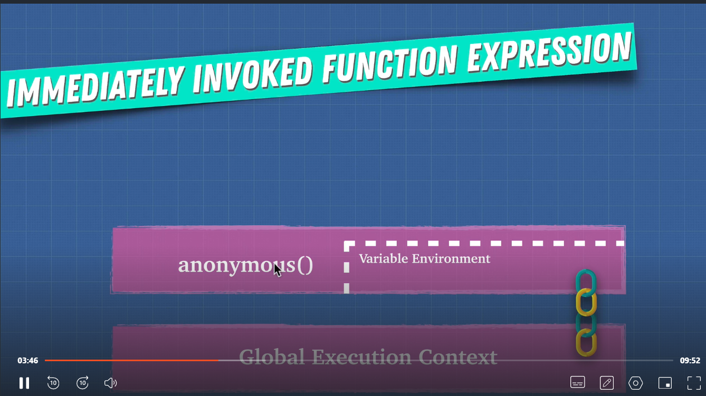

# Advanced JavaScript - Execution Context & Scoping

## Table of Contents

- [1. Execution Context](#1-execution-context)
  - [1.1 What is Execution Context](#11-what-is-execution-context)
  - [1.2 Call Stack Example](#12-call-stack-example)
  - [1.3 Global Execution Context](#13-global-execution-context)
- [2. Lexical Environment](#2-lexical-environment)
- [3. Hoisting](#3-hoisting)
  - [3.1 How Hoisting Works](#31-how-hoisting-works)
  - [3.2 Variables vs Functions](#32-variables-vs-functions)
  - [3.3 Complex Hoisting Example](#33-complex-hoisting-example)
- [4. Functions and Arguments](#4-functions-and-arguments)
  - [4.1 Function Expression vs Declaration](#41-function-expression-vs-declaration)
  - [4.2 Function Invocation](#42-function-invocation)
  - [4.3 Arguments Object](#43-arguments-object)
  - [4.4 Modern Alternatives](#44-modern-alternatives)
- [5. Variable Environment](#5-variable-environment)
- [6. Scope Chain](#6-scope-chain)
- [7. Use Strict](#7-use-strict)
- [8. Function Scope vs Block Scope](#8-function-scope-vs-block-scope)
- [9. IIFE (Immediately Invoked Function Expression)](#9-iife-immediately-invoked-function-expression)
  - [9.1 Global Namespace Pollution](#91-global-namespace-pollution)
  - [9.2 IIFE Solution](#92-iife-solution)
- [10. The 'this' Keyword](#10-the-this-keyword)
  - [10.1 Basic Understanding](#101-basic-understanding)
  - [10.2 Method Binding Examples](#102-method-binding-examples)
  - [10.3 Arrow Functions vs Regular Functions](#103-arrow-functions-vs-regular-functions)
- [11. call(), apply(), bind() Methods](#11-call-apply-bind-methods)
  - [11.1 call() Method](#111-call-method)
  - [11.2 apply() Method](#112-apply-method)
  - [11.3 bind() Method](#113-bind-method)
  - [11.4 Practical Examples](#114-practical-examples)
- [12. Context vs Scope](#12-context-vs-scope)

---

## 1. Execution Context

### 1.1 What is Execution Context

**Execution Context** is the environment in which JavaScript code is executed. When a JavaScript file runs, the **Global Execution Context** is created first, which tells the engine: "This is the whole JS file, read it and start executing the functions."

### 1.2 Call Stack Example

```js
function printMyName() {
  return "Saksham Gupta";
}

function getMyName() {
  return printMyName();
}

function sayMyName() {
  return getMyName();
}

sayMyName();
```

**Execution Order:**

```
Global Execution Context() → sayMyName() → getMyName() → printMyName()
```

Each function call creates a new execution context and gets added to the **call stack** in this order.

### 1.3 Global Execution Context

The global execution context provides two important things:

1. **Global object** (e.g., `window` in browsers)
2. **`this` object** (initially points to the global object)

## 2. Lexical Environment

The **Lexical Environment** is the local environment of each function call. Each function has its own "world" or scope. The first lexical scope in JavaScript is the **global lexical scope**.

## 3. Hoisting

### 3.1 How Hoisting Works

**Hoisting** is JavaScript's behavior of moving variable and function declarations to the top of their scope during the compilation phase. However, the code itself doesn't physically move - instead, JavaScript reserves memory for these declarations.

### 3.2 Variables vs Functions

- **Variables** (declared with `var`): Hoisted and initialized with `undefined`
- **Functions**: Fully hoisted with their complete definition
- **`let` and `const`**: Not hoisted in the same way (temporal dead zone)

### 3.3 Complex Hoisting Example

```js
console.log("1-----");
console.log(teddy); // undefined
sing(); // "la la la la"

var teddy = "bear";
function sing() {
  return "la la la la";
}
```

**Complex Example:**

```js
var favouriteFood = "Grapes";

var foodThoughts = function () {
  console.log("Original favourite food is: " + favouriteFood);
  var favouriteFood = "apple";
  console.log("New favourite food is: " + favouriteFood);
};

foodThoughts();
```

**Output:**

```
Original favourite food is: undefined
New favourite food is: apple
```

**Explanation:** Inside the function, `favouriteFood` is hoisted within that function's execution context, so it shadows the global variable and gets initialized as `undefined` before being assigned "apple".

## 4. Functions and Arguments

### 4.1 Function Expression vs Declaration

```js
// Function Expression
var canada = () => {
  // Defined at runtime, initially undefined due to hoisting
  console.log("Cold");
};

// Function Declaration
function india() {
  // Initialized at parse time and fully hoisted
  console.log("Warm");
}

// Function Invocation/Call/Execution
canada();
india();
```

### 4.2 Function Invocation

During function invocation, JavaScript creates an execution context that provides:

- **`this` keyword**
- **`arguments` keyword**

### 4.3 Arguments Object

```js
function marry(person1, person2) {
  console.log(arguments);
  console.log(`${person1} marries to ${person2}`);
}

marry("Tim", "Teena");
```

**Output:**

```
{0: "Tim", 1: "Teena"} // Arguments provided in object form
Tim marries to Teena
```

⚠️ **Note:** The `arguments` keyword is not optimized in modern JavaScript engines and should be avoided.

### 4.4 Modern Alternatives

**Using Rest Parameters (Recommended):**

```js
function marry(...args) {
  console.log(args);
  console.log(`${args[0]} marries to ${args[1]}`);
}
marry("Tim", "Teena");
// Output: ["Tim", "Teena"]
```

**Converting Arguments to Array:**

```js
function marry(person1, person2) {
  console.log(Array.from(arguments));
  console.log(`${person1} marries to ${person2}`);
}
marry("Tim", "Teena");
```

## 5. Variable Environment

Each function execution context has its own **variable environment**, where each variable exists within its lexical scope.

## 6. Scope Chain

Each function execution context is linked to:

- The **global execution context**
- Its **parent context**
  

Functions defined in global scope are available in the `window` object, with a `[[scope]]` property of type "global".


## 7. Use Strict

**Problem without strict mode:**

```js
function sayHello() {
  message = "Hello How are you!";
  console.log(message); // Works, but creates global variable
}
```

The `message` variable gets automatically created in global scope - a problematic behavior.

**Solution with strict mode:**

```js
"use strict";
function sayHello() {
  message = "Hello How are you!";
  console.log(message); // ReferenceError: message is not defined
}
```

Use `"use strict"` at the top of your JavaScript file to avoid these issues.

## 8. Function Scope vs Block Scope

```js
if (5 > 4) {
  var secret = "12345";
}

console.log(secret); // '12345' - accessible outside block
```

- **`var`**: Function-scoped (ignores block scope)
- **`let` and `const`**: Block-scoped (ES6 feature)

## 9. IIFE (Immediately Invoked Function Expression)

### 9.1 Global Namespace Pollution

When multiple variables are declared in the global scope, conflicts can occur:

```html
<html>
  <body></body>
  <script>
    var z = 5;
  </script>
  <script>
    var zzz = 555;
  </script>
  <script>
    var z = 500;
  </script>
  <!-- Overwrites previous z -->
</html>
```

### 9.2 IIFE Solution

```js
(function () {
  var z = 1000;
  console.log(z); // 1000
})();
// z is not accessible outside - prevents global pollution
```

**How IIFE works:**

- Parentheses `()` make JavaScript treat it as a function expression
- Variables inside remain in local scope only
- Prevents global namespace pollution
  

## 10. The 'this' Keyword

### 10.1 Basic Understanding

**`this`** is a special reserved keyword that refers to the object whose method is being invoked. **Rule:** Whatever is on the left side of the method call becomes `this`.

### 10.2 Method Binding Examples

```js
function sayMyName() {
  console.log(`Hi ${this.name}!`);
}

var obj = {
  name: "Jacob",
  sayMyName: sayMyName,
};

var name = "Sunny";

var obj1 = {
  name: "Sam",
  sayMyName: sayMyName,
};

obj.sayMyName(); // this refers to obj → "Hi Jacob!"
obj1.sayMyName(); // this refers to obj1 → "Hi Sam!"
sayMyName(); // this refers to window → "Hi Sunny!"
```

### 10.3 Arrow Functions vs Regular Functions

**Regular Functions:**

```js
const a = function () {
  console.log(this); // window
  const b = function () {
    console.log(this); // window
    const c = {
      hi: function () {
        console.log(this); // c object
      },
    };
    c.hi();
  };
  b();
};
a();
```

**Arrow Functions (Lexically Bound):**

```js
const obj = {
  name: "Billy",
  sing() {
    console.log(this); // obj
    const ab = () => {
      console.log(this); // obj (inherits from parent scope)
    };
    ab();
  },
};
```

## 11. call(), apply(), bind() Methods

### 11.1 call() Method

Allows one object to borrow methods from another object:

```js
const wizard = {
  name: "Merlin",
  health: 50,
  heal(num1, num2) {
    return (this.health += num1 + num2);
  },
};

const archer = {
  name: "Robin Hood",
  health: 30,
};

// Archer borrows wizard's heal method
wizard.heal.call(archer, 30, 50); // archer.health becomes 110
```

### 11.2 apply() Method

Works exactly like `call()`, but parameters are passed as an array:

```js
wizard.heal.apply(archer, [30, 50]); // Same result as call()
```

### 11.3 bind() Method

Returns a new function with `this` bound to the specified object:

```js
const healArcher = wizard.heal.bind(archer);
healArcher(30, 50); // Can be called later
```

### 11.4 Practical Examples

**Currying with bind():**

```js
const multiply = (a, b) => {
  return a * b;
};

const multiplyByTwo = multiply.bind(this, 2);
console.log(multiplyByTwo(4)); // 8
```

**Practice Problem:**

```js
const character = {
  name: "Simon",
  getCharacter() {
    return this.name;
  },
};

const giveMeTheCharacterNOW = character.getCharacter;
console.log("?", giveMeTheCharacterNOW()); // undefined

// Solution:
const giveMeTheCharacterNOW = character.getCharacter.bind(character);
console.log("?", giveMeTheCharacterNOW()); // "Simon"
```

**Complex 'this' Examples:**

```js
const a = {
  name: "a",
  say() {
    console.log(this); // a object
  },
};

const b = {
  name: "b",
  say: function () {
    return function () {
      console.log(this); // window object
    };
  },
};

const c = {
  name: "c",
  say: function () {
    return () => {
      console.log(this); // c object (arrow function)
    };
  },
};
```

## 12. Context vs Scope

| Aspect            | Context                             | Scope                                                |
| ----------------- | ----------------------------------- | ---------------------------------------------------- |
| **Definition**    | Where the function is being invoked | Visible area where variables and methods are defined |
| **Relates to**    | `this` keyword and object binding   | Variable accessibility and lifetime                  |
| **Determined by** | How function is called              | Where variables are declared                         |

**Context** = **WHO** is calling the function  
**Scope** = **WHERE** variables are accessible

---

_These notes cover fundamental concepts of JavaScript execution, scoping, and the behavior of `this`. Master these concepts to understand advanced JavaScript patterns and frameworks._
