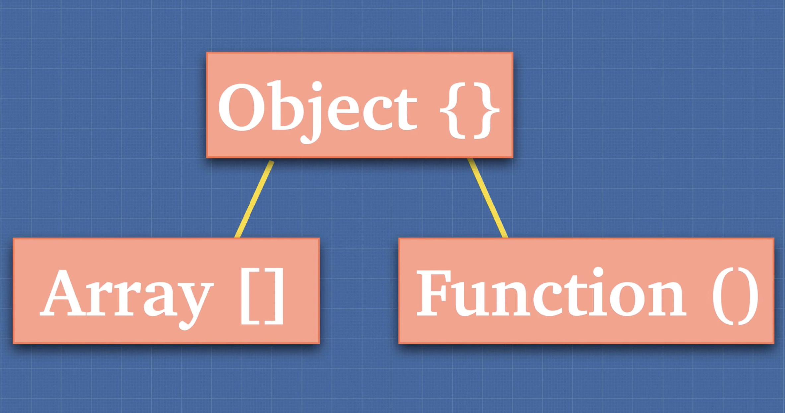

# JavaScript Types & Data Handling - Study Notes

## Table of Contents

- [1. JavaScript Data Types Overview](#1-javascript-data-types-overview)
  - [1.1 The Seven JavaScript Types](#11-the-seven-javascript-types)
  - [1.2 Common Misconceptions](#12-common-misconceptions)
  - [1.3 The typeof null Quirk](#13-the-typeof-null-quirk)
- [2. Type Categories](#2-type-categories)
  - [2.1 Primitive Types](#21-primitive-types)
  - [2.2 Non-Primitive Types](#22-non-primitive-types)
  - [2.3 Arrays and Functions as Objects](#23-arrays-and-functions-as-objects)
- [3. Built-in Objects](#3-built-in-objects)
  - [3.1 Understanding Built-in Objects](#31-understanding-built-in-objects)
  - [3.2 Primitive Wrapper Objects](#32-primitive-wrapper-objects)
  - [3.3 Automatic Boxing](#33-automatic-boxing)
- [4. Pass by Value vs Pass by Reference](#4-pass-by-value-vs-pass-by-reference)
  - [4.1 Pass by Value (Primitives)](#41-pass-by-value-primitives)
  - [4.2 Pass by Reference (Objects)](#42-pass-by-reference-objects)
- [5. Object Copying](#5-object-copying)
  - [5.1 The Reference Problem](#51-the-reference-problem)
  - [5.2 Shallow Copy](#52-shallow-copy)
  - [5.3 Deep Copy Challenges](#53-deep-copy-challenges)
  - [5.4 Deep Copy Solutions](#54-deep-copy-solutions)
- [6. Modern Deep Cloning](#6-modern-deep-cloning)
  - [6.1 structuredClone() Method](#61-structuredclone-method)
  - [6.2 Advantages over JSON Methods](#62-advantages-over-json-methods)
- [7. Additional Resources](#7-additional-resources)

---

## 1. JavaScript Data Types Overview

### 1.1 The Seven JavaScript Types

JavaScript has **seven fundamental data types**:

1. **String** - Text data (`"hello"`, `'world'`)
2. **Number** - Numeric values (`42`, `3.14`, `NaN`, `Infinity`)
3. **Boolean** - True/false values (`true`, `false`)
4. **undefined** - Declared but unassigned variables
5. **null** - Intentional absence of value
6. **Symbol** - Unique identifiers (introduced in ES6)
7. **Object** - Complex data structures (includes arrays, functions, objects)

### 1.2 Common Misconceptions

**"Where are arrays and functions?"**

Many developers wonder why arrays and functions aren't listed as separate types. The answer: **they are all objects** under the hood.

```javascript
typeof []; // "object"
typeof {}; // "object"
typeof function () {}; // "function" (but still an object internally)
```

### 1.3 The typeof null Quirk

One of JavaScript's most famous **legacy bugs**:

```javascript
typeof null; // "object" (This is wrong!)
```

This is a well-known JavaScript quirk that dates back to the language's creation. The `typeof null` returning `"object"` is technically incorrect, but it was never fixed because:

- **Legacy code compatibility** - Millions of websites would break
- **Historical reasons** - Too much existing code depends on this behavior

This is considered one of the "weird parts" of JavaScript that developers must simply accept and work around.

---

## 2. Type Categories

### 2.1 Primitive Types

**Primitive types** hold a single, immutable value:

- `string`
- `number`
- `boolean`
- `undefined`
- `null`
- `symbol`

**Key characteristics:**

- Stored directly in memory
- **Immutable** - cannot be changed, only replaced
- Passed by value
- Compared by value

### 2.2 Non-Primitive Types

**Non-primitive types** are complex data structures:

- `object` (includes arrays, functions, dates, etc.)

**Key characteristics:**

- Stored as references in memory
- **Mutable** - can be modified after creation
- Passed by reference
- Compared by reference (not content)

### 2.3 Arrays and Functions as Objects

```javascript
// Arrays are objects
const arr = [1, 2, 3];
console.log(typeof arr); // "object"

// Functions are objects (with special behavior)
const fn = function () {};
console.log(typeof fn); // "function" (special case)
console.log(fn instanceof Object); // true
```

While `typeof function(){}` returns `"function"`, functions are still objects internally with additional callable behavior.



---

## 3. Built-in Objects

### 3.1 Understanding Built-in Objects

JavaScript provides many **built-in objects** that extend functionality. Reference: [MDN Built-in Objects](https://developer.mozilla.org/en-US/docs/Web/JavaScript/Reference/Global_Objects)

These built-in objects include both:

- **Object constructors** for primitives (`String`, `Number`, `Boolean`)
- **Complex objects** (`Array`, `Date`, `RegExp`, `Promise`)

### 3.2 Primitive Wrapper Objects

**Confusing concept:** If primitives like `boolean`, `string`, and `number` aren't objects, how can they have methods?

```javascript
true.toString(); // "true" - How does this work?
```

### 3.3 Automatic Boxing

JavaScript performs **automatic boxing** behind the scenes:

```javascript
// What you write:
true.toString();

// What JavaScript does internally:
Boolean(true).toString();
```

**The process:**

1. JavaScript temporarily **wraps** the primitive in its corresponding object wrapper
2. Calls the method on the wrapper object
3. **Discards** the wrapper object
4. Returns the result

This is why primitives can have methods while remaining primitive types. JavaScript's flexibility: _"Most things are objects, but not objects at the same time."_

---

## 4. Pass by Value vs Pass by Reference

### 4.1 Pass by Value (Primitives)

Primitive types are **copied by value**:

```javascript
const a = 5;
const b = a; // b gets a COPY of a's value

a = 6; // This doesn't affect b

console.log(a); // 6
console.log(b); // 5 (unchanged)
```

**What happens:**

- `b` receives a completely separate copy of the value
- Changes to `a` don't affect `b`
- Each variable has its own memory space

### 4.2 Pass by Reference (Objects)

Objects are **copied by reference**:

```javascript
const obj1 = {
	a: "a",
	b: "b",
};

const obj2 = obj1; // obj2 points to the SAME object

obj1.a = 5; // Modifying through obj1

console.log(obj1); // {a: 5, b: "b"}
console.log(obj2); // {a: 5, b: "b"} - Also changed!
```

**What happens:**

- `obj2` receives a reference (memory address) to the same object
- Both variables point to the same object in memory
- Changes through either variable affect the same object

---

## 5. Object Copying

### 5.1 The Reference Problem

When working with objects, simple assignment creates shared references, not copies. This can lead to unintended side effects.

### 5.2 Shallow Copy

**Solution:** Use the spread operator (`...`) for shallow copying:

```javascript
const obj1 = {
	a: "a",
	b: "b",
};

const obj2 = { ...obj1 }; // Shallow copy

obj1.a = "changed";

console.log(obj1); // {a: "changed", b: "b"}
console.log(obj2); // {a: "a", b: "b"} - Unchanged!
```

### 5.3 Deep Copy Challenges

**Problem:** Shallow copy only works for one level deep:

```javascript
const obj1 = {
	a: "a",
	b: {
		deep: "Hi try to deep copy me",
	},
};

const obj2 = { ...obj1 }; // Shallow copy

obj1.b.deep = "HA HA HA! I fooled you. You did shallow copy above";

console.log(obj1.b); // {deep: "HA HA HA! I fooled you..."}
console.log(obj2.b); // {deep: "HA HA HA! I fooled you..."} - Also changed!
```

**Why this happens:**

- Spread operator only copies the first level
- Nested objects are still shared by reference
- `obj1.b` and `obj2.b` point to the same nested object

### 5.4 Deep Copy Solutions

**Traditional approach** using JSON methods:

```javascript
const obj2 = JSON.parse(JSON.stringify(obj1));
```

**Limitations of JSON approach:**

- Loses functions, undefined values, and symbols
- Doesn't handle dates, regular expressions properly
- Can't handle circular references
- Performance overhead for large objects

---

## 6. Modern Deep Cloning

### 6.1 structuredClone() Method

**Modern solution:** The `structuredClone()` method provides proper deep cloning:

```javascript
const obj1 = {
	a: "a",
	b: {
		deep: "Deep value",
		date: new Date(),
		func: () => console.log("Hello"),
	},
};

const obj2 = structuredClone(obj1);
```

**Reference:** [MDN structuredClone()](https://developer.mozilla.org/en-US/docs/Web/API/Window/structuredClone)

### 6.2 Advantages over JSON Methods

`structuredClone()` uses the [Structured Clone Algorithm](https://developer.mozilla.org/en-US/docs/Web/API/Web_Workers_API/Structured_clone_algorithm) which:

- **Preserves more data types** (Date objects, RegExp, Maps, Sets)
- **Handles circular references**
- **Better performance** for complex objects
- **More reliable** than JSON stringify/parse

**Browser support:** Available in modern browsers (Chrome 98+, Firefox 94+, Safari 15.4+)

---

## 7. Additional Resources

### Object Comparison

For comprehensive object comparison techniques, refer to this Stack Overflow discussion: [Object Comparison in JavaScript](https://stackoverflow.com/questions/1068834/object-comparison-in-javascript)

### Key Takeaways

1. **Know your types** - Understanding primitive vs non-primitive is crucial
2. **Watch for references** - Objects share references, primitives don't
3. **Choose the right copying method** - Shallow vs deep copy based on your needs
4. **Use modern APIs** - `structuredClone()` is better than JSON methods
5. **Remember the quirks** - `typeof null === "object"` is a historical bug

### Best Practices

- Always be explicit about copying intentions
- Use `structuredClone()` for deep copying when available
- Be aware of reference sharing in object assignments
- Test your copying logic with nested objects
- Consider immutable data patterns for complex applications
