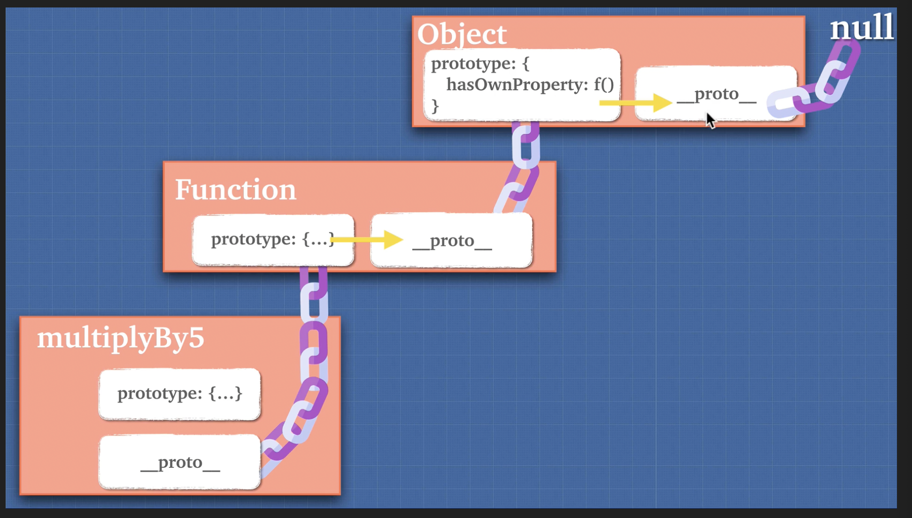

# The 2 Pillars of JavaScript - Closures and Prototypal Inheritance

## Table of Contents

- [1. Functions as Objects](#1-functions-as-objects)
  - [1.1 Function Declaration Methods](#11-function-declaration-methods)
  - [1.2 Function Invocation Patterns](#12-function-invocation-patterns)
- [2. First Class Citizens](#2-first-class-citizens)
- [3. Higher Order Functions](#3-higher-order-functions)
  - [3.1 Definition and Example](#31-definition-and-example)
  - [3.2 Practical Implementation](#32-practical-implementation)
- [4. Closures](#4-closures)
  - [4.1 Understanding Closures](#41-understanding-closures)
  - [4.2 How Closures Work](#42-how-closures-work)
  - [4.3 Memory Retention](#43-memory-retention)
- [5. Closures and Memory Efficiency](#5-closures-and-memory-efficiency)
  - [5.1 Inefficient vs Efficient Code](#51-inefficient-vs-efficient-code)
  - [5.2 Practical Applications](#52-practical-applications)
  - [5.3 Common Closure Patterns](#53-common-closure-patterns)
- [6. Prototypes](#6-prototypes)
  - [6.1 Prototypal Inheritance Concept](#61-prototypal-inheritance-concept)
  - [6.2 Prototype Chain](#62-prototype-chain)
  - [6.3 Practical Example](#63-practical-example)
- [7. Creating Prototype Chains](#7-creating-prototype-chains)
  - [7.1 The **proto** Warning](#71-the-__proto__-warning)
  - [7.2 Object.create() Method](#72-objectcreate-method)
- [8. Extending Built-in Objects](#8-extending-built-in-objects)
  - [8.1 Date Object Extension](#81-date-object-extension)
  - [8.2 Array Method Modification](#82-array-method-modification)

---

## 1. Functions as Objects

### 1.1 Function Declaration Methods

Previously we learned that **functions are objects** in JavaScript. When functions are called, an execution context is created containing:

- `this` keyword
- `arguments` keyword
- Variable environment

### 1.2 Function Invocation Patterns

**1. Arrow Function Declaration:**

```js
const a = () => {
	return "a";
};
a();
```

**2. Object Method:**

```js
const obj = {
	b() {
		return "b";
	},
};
obj.b();
```

**3. Using call/apply:**

```js
const c = () => {
	return "c";
};
c.call(); // Same as c()
```

**4. Function Constructor:**

```js
const d = new Function("num", "return num");
d(5); // Returns 5
```

## 2. First Class Citizens

Functions are referred to as **first-class citizens** in JavaScript because they can be:

- Assigned to variables
- Passed as arguments to other functions
- Returned from functions
- Stored in data structures
- Created at runtime

## 3. Higher Order Functions

### 3.1 Definition and Example

A **Higher Order Function** is a function that either:

- Takes another function as an argument, OR
- Returns a function

### 3.2 Practical Implementation

```js
const multiplyBy = (num1) => {
	return (num2) => {
		return num1 * num2;
	};
};

const multiplyBy2 = multiplyBy(2);
const multiplyBy3 = multiplyBy(3);
const multiplyBy4 = multiplyBy(4);

console.log(multiplyBy2(10)); // 20
console.log(multiplyBy3(10)); // 30
console.log(multiplyBy4(10)); // 40
```

This demonstrates **function currying** - a technique where a function returns another function with some arguments pre-configured.

## 4. Closures

### 4.1 Understanding Closures

**Technical Definition:** A closure is a combination of a function and the lexical environment within which that function was declared.

**Simple Definition:** When a function is defined inside another function, the inner function retains access to the outer function's variables and parameters, even after the outer function has finished executing and been removed from the call stack.

### 4.2 How Closures Work

```js
const a = () => {
	const hour = 20;
	return function b() {
		const minutes = 45;
		return function c() {
			const seconds = 30;
			return `${hour}:${minutes}:${seconds}`;
		};
	};
};

a()()(); // "20:45:30"
```

**Execution Flow:**

1. Function `a` executes → creates `hour` variable → returns function `b` → removed from call stack
2. Function `b` executes → creates `minutes` variable → returns function `c` → removed from call stack
3. Function `c` executes → still has access to `hour` and `minutes` → returns formatted time

### 4.3 Memory Retention

**Key Question:** How does function `c` access `hour` and `minutes` when functions `a` and `b` are no longer in the call stack?

**Answer:** JavaScript's **closure mechanism** retains these variables in heap memory as long as there are references to them. When functions are removed from the call stack, their variables are kept in memory if they're "closed over" by inner functions.

This prevents garbage collection of these variables until all references are removed.

## 5. Closures and Memory Efficiency

### 5.1 Inefficient vs Efficient Code

**❌ Inefficient Approach:**

```js
const heavyDuty = (ind) => {
	const bigArr = Array.from({ length: 1_000_000 }, (_, i) => i);
	return bigArr[ind];
};

heavyDuty(100); // Creates new array
heavyDuty(500); // Creates new array again
heavyDuty(700); // Creates new array again
```

**✅ Efficient Approach with Closures:**

```js
const heavyDuty1 = () => {
	const bigArr = Array.from({ length: 1_000_000 }, (_, i) => i);
	return (ind) => bigArr[ind];
};

const getValAtInd = heavyDuty1();
getValAtInd(100); // Reuses same array
getValAtInd(500); // Reuses same array
getValAtInd(700); // Reuses same array
```

**Benefits:** The `bigArr` is created only once and "closured" in memory, making subsequent calls much more efficient.

### 5.2 Practical Applications

**Function That Runs Only Once:**

```js
let view = "";

const setView = () => {
	let called = 0;
	return () => {
		if (called >= 1) return;
		called++;
		view = "🗻";
		console.log("View is set");
	};
};

const setViewCall = setView();
setViewCall(); // "View is set"
setViewCall(); // Nothing happens
setViewCall(); // Nothing happens
setViewCall(); // Nothing happens
console.log(view); // "🗻"
```

### 5.3 Common Closure Patterns

**IIFE with Closure for Loop:**

```js
const arr = [1, 2, 3, 4];

for (var i = 0; i < 4; i++) {
	(function (closureI) {
		setTimeout(() => {
			console.log(closureI); // Prints: 0, 1, 2, 3
		}, 1000);
	})(i);
}
```

**Why this works:** Each IIFE creates its own closure with the current value of `i`, preventing the common issue where all timeouts would print the final value of `i`.

## 6. Prototypes

### 6.1 Prototypal Inheritance Concept

JavaScript uses **prototypal inheritance** rather than classical inheritance. Remember: JavaScript heavily relies on objects, and even arrays and functions are objects.

### 6.2 Prototype Chain

```js
const arr = [];
arr.__proto__; // Array prototype (methods like concat, find, etc.)
arr.__proto__.__proto__; // Base Object prototype
```

Every object in JavaScript has a prototype chain that eventually leads to the base `Object` prototype.

### 6.3 Practical Example

**Initial Setup:**

```js
let dragon = {
	name: "Tanya",
	fight: true,
	fire() {
		return 5;
	},
	sing() {
		return `${this.name} is singing`;
	},
};

let lizard = {
	name: "Kiki",
	fire() {
		return 1;
	},
};
```

**Using bind() for method borrowing:**

```js
dragon.sing.bind(lizard)(); // "Kiki is singing"
```

**Problem with conditional methods:**

```js
dragon = {
	...dragon,
	sing() {
		if (this.fight) {
			return `${this.name} is singing`;
		}
	},
};

dragon.sing.bind(lizard)(); // undefined (lizard has no 'fight' property)
```

**Solution using prototype chain:**

```js
lizard.__proto__ = dragon;

lizard.sing(); // "Kiki is singing"
lizard.fire(); // 1 (uses lizard's own method)
```

**How it works:**

1. JavaScript looks for `sing()` in `lizard` object
2. Not found, so it looks up the prototype chain to `dragon`
3. Finds `sing()` in `dragon` and executes it with `lizard` as `this`
4. Since `lizard` now inherits `fight: true` from `dragon`, the condition passes

Look at the image below for function prototypal chain.


## 7. Creating Prototype Chains

### 7.1 The **proto** Warning

⚠️ **WARNING:** Never use `__proto__` in production code!

```js
// ❌ DON'T DO THIS
lizard.__proto__ = dragon;
```

**Why avoid `__proto__`:**

- Can hinder performance
- Interferes with compiler optimizations
- Not part of the official ECMAScript specification
- Can cause unexpected behavior

### 7.2 Object.create() Method

**✅ Recommended Approach:**

```js
let lizard = Object.create(dragon);
lizard.name = "Kiki";
lizard.fire = function () {
	return 1;
};
```

`Object.create()` properly establishes the prototype chain without the performance issues of `__proto__`.

## 8. Extending Built-in Objects

### 8.1 Date Object Extension

**Exercise: Add .lastYear() method to Date:**

```js
Date.prototype.lastYear = function () {
	return this.getFullYear() - 1;
};

new Date("1900-10-10").lastYear(); // 1899
```

### 8.2 Array Method Modification

**Bonus Exercise: Modify .map() to add emoji:**

```js
Array.prototype.map = function () {
	let arr = [];
	for (let i = 0; i < this.length; i++) {
		arr.push(this[i] + "🗺️");
	}
	return arr;
};

console.log([1, 2, 3].map()); // ["1🗺️", "2🗺️", "3🗺️"]
```

**Note:** Modifying built-in prototypes should be done cautiously in production code as it can lead to conflicts and unexpected behavior.

---

## Key Takeaways

### Closures

- **Enable data privacy** and encapsulation
- **Improve memory efficiency** when used correctly
- **Retain variable references** even after outer functions finish
- **Power many JavaScript patterns** (modules, callbacks, event handlers)

### Prototypal Inheritance

- **All objects inherit** from other objects
- **Prototype chain** allows method and property sharing
- **More flexible** than classical inheritance
- **Foundation** for JavaScript's object-oriented features

### Best Practices

- Use `Object.create()` instead of `__proto__`
- Leverage closures for data encapsulation
- Be mindful of memory implications with closures
- Understand the prototype chain for debugging
- Avoid modifying built-in prototypes in production

_These two pillars - closures and prototypal inheritance - form the foundation of advanced JavaScript programming and are essential for understanding frameworks, libraries, and complex application architectures._
