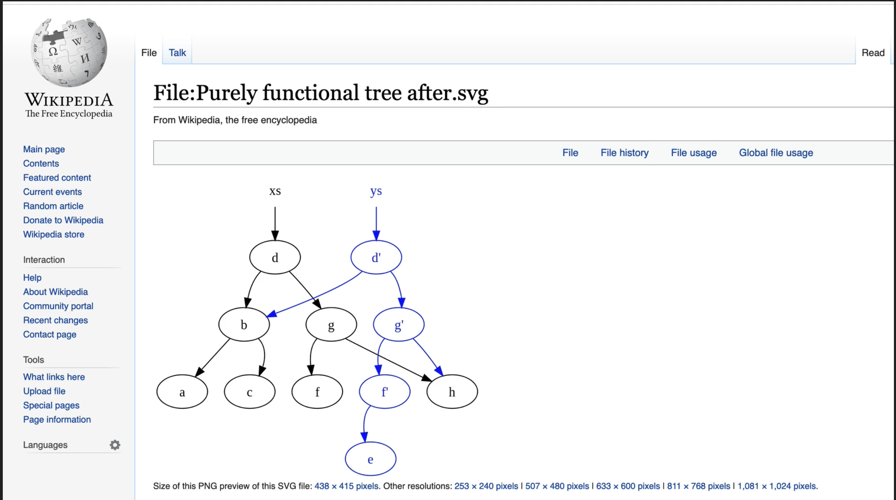

# Functional Programming in JavaScript - Complete Guide

## Table of Contents
- [1. Introduction to Functional Programming](#1-introduction-to-functional-programming)
- [2. Pure Functions](#2-pure-functions)
  - [2.1 Definition and Characteristics](#21-definition-and-characteristics)
  - [2.2 Examples of Pure vs Impure Functions](#22-examples-of-pure-vs-impure-functions)
  - [2.3 Limitations of Pure Functions](#23-limitations-of-pure-functions)
- [3. Idempotent Functions](#3-idempotent-functions)
  - [3.1 Understanding Idempotence](#31-understanding-idempotence)
  - [3.2 Examples and Use Cases](#32-examples-and-use-cases)
- [4. Imperative vs Declarative Programming](#4-imperative-vs-declarative-programming)
  - [4.1 Core Differences](#41-core-differences)
  - [4.2 Code Examples](#42-code-examples)
  - [4.3 When to Use Each Approach](#43-when-to-use-each-approach)
- [5. Immutability](#5-immutability)
  - [5.1 Understanding Immutability](#51-understanding-immutability)
  - [5.2 Implementing Immutable Operations](#52-implementing-immutable-operations)
  - [5.3 Memory Considerations and Structural Sharing](#53-memory-considerations-and-structural-sharing)
- [6. Currying](#6-currying)
  - [6.1 What is Currying](#61-what-is-currying)
  - [6.2 Currying Examples](#62-currying-examples)
  - [6.3 Benefits of Currying](#63-benefits-of-currying)
- [7. Partial Application](#7-partial-application)
  - [7.1 Understanding Partial Application](#71-understanding-partial-application)
  - [7.2 Partial Application vs Currying](#72-partial-application-vs-currying)
- [8. Memoization (Caching)](#8-memoization-caching)
  - [8.1 What is Memoization](#81-what-is-memoization)
  - [8.2 Implementation Examples](#82-implementation-examples)
  - [8.3 When to Use Memoization](#83-when-to-use-memoization)
- [9. Compose and Pipe](#9-compose-and-pipe)
  - [9.1 Function Composition](#91-function-composition)
  - [9.2 Understanding Compose](#92-understanding-compose)
  - [9.3 Understanding Pipe](#93-understanding-pipe)
  - [9.4 Popular Libraries](#94-popular-libraries)
- [10. Real-World Functional Programming](#10-real-world-functional-programming)
  - [10.1 E-commerce Cart Example](#101-e-commerce-cart-example)
  - [10.2 Best Practices](#102-best-practices)
- [11. OOP vs Functional Programming](#11-oop-vs-functional-programming)
  - [11.1 Composition vs Inheritance](#111-composition-vs-inheritance)
  - [11.2 When to Choose Each Paradigm](#112-when-to-choose-each-paradigm)

---

## 1. Introduction to Functional Programming

**Functional Programming (FP)** is a programming paradigm that treats computation as the evaluation of mathematical functions. It emphasizes:

- **Pure functions** - Functions without side effects
- **Immutability** - Data that doesn't change after creation
- **Function composition** - Building complex operations from simple functions
- **Declarative style** - Describing what you want, not how to achieve it

## 2. Pure Functions

### 2.1 Definition and Characteristics

A **pure function** has two main characteristics:

1. **No side effects** - Doesn't modify anything outside the function
2. **Deterministic** - Always returns the same output for the same input

### 2.2 Examples of Pure vs Impure Functions

**✅ Pure Functions:**
```js
const arr = [1, 2, 3];

// Pure - doesn't mutate original array
const mutateArr = (array) => {
    const copyArr = [...array];
    copyArr.pop();
    return copyArr;
};

// Pure - creates new array without mutation
const multiplyBy2Arr = (array) => {
    return array.map((val) => {
        return val * 2;
    });
};

// Pure - predictable mathematical operation
const add = (a, b) => a + b;

// Pure - string manipulation without side effects
const toUpperCase = (str) => str.toUpperCase();
```

**❌ Impure Functions:**
```js
// Impure - creates side effect (console output)
const a = () => {
    console.log("hi");
};

// Impure - depends on external variable
let counter = 0;
const increment = () => {
    counter++; // Modifies external state
    return counter;
};

// Impure - non-deterministic (different output each time)
const getRandomNumber = () => {
    return Math.random();
};

// Impure - modifies input parameter
const addToArray = (arr, item) => {
    arr.push(item); // Mutates original array
    return arr;
};
```

### 2.3 Limitations of Pure Functions

**Can every function in JavaScript be pure?** 

**No!** Some functions inherently need side effects:
- DOM manipulation
- API calls
- File I/O operations
- Logging
- Database operations
- Random number generation

**Strategy**: Isolate side effects to specific parts of your application while keeping the core logic pure.

## 3. Idempotent Functions

### 3.1 Understanding Idempotence

**Idempotent** functions can be applied multiple times without changing the result beyond the initial application. The function does exactly what it's designed to do, regardless of how many times it's called.

### 3.2 Examples and Use Cases

**Mathematical Operations:**
```js
// Idempotent - Math.abs always returns absolute value
const makePositive = (num) => Math.abs(num);
makePositive(-5); // 5
makePositive(-5); // 5 (same result)

// Non-idempotent - returns different values
const getRandomValue = (num) => {
    return Math.random();
};
getRandomValue(5); // 0.123...
getRandomValue(5); // 0.847... (different result)
```

**Logging Operations:**
```js
// Idempotent behavior - same message logged
const logMessage = (num) => {
    console.log(num);
};
logMessage(5); // Logs: 5
logMessage(5); // Logs: 5 (same behavior)
```

**Database Operations:**
```js
// Idempotent - deleting same user multiple times has same effect
const deleteUser = (userId) => {
    // After first deletion, subsequent calls don't change anything
    return database.delete({ id: userId });
};

// Idempotent HTTP operations
// GET /users/123 - Always returns same user data
// PUT /users/123 - Updates user to specific state
// DELETE /users/123 - User is deleted (subsequent calls don't change state)
```

## 4. Imperative vs Declarative Programming

### 4.1 Core Differences

| Aspect | Imperative (HOW) | Declarative (WHAT) |
|--------|------------------|-------------------|
| **Focus** | Step-by-step instructions | Desired outcome |
| **Control** | Explicit control flow | Hidden control flow |
| **Style** | "How to do it" | "What to achieve" |
| **Examples** | Loops, conditions | Array methods, SQL |

### 4.2 Code Examples

**Getting Even Numbers from Array:**

**Imperative Approach:**
```js
const numbers = [1, 2, 3, 4, 5, 6, 7, 8, 9, 10];

// HOW to get even numbers
const evenNumbers = [];
for (let i = 0; i < numbers.length; i++) {
    if (numbers[i] % 2 === 0) {
        evenNumbers.push(numbers[i]);
    }
}
console.log(evenNumbers); // [2, 4, 6, 8, 10]
```

**Declarative Approach:**
```js
const numbers = [1, 2, 3, 4, 5, 6, 7, 8, 9, 10];

// WHAT we want - even numbers
const evenNumbers = numbers.filter(num => num % 2 === 0);
console.log(evenNumbers); // [2, 4, 6, 8, 10]
```

**Real-World Navigation Analogy:**

**Imperative (GPS Turn-by-Turn):**
- "Head north on Main Street for 0.5 miles"
- "Turn right onto Oak Avenue"
- "Continue for 200 yards"
- "Turn left onto Elm Street"

**Declarative (Address):**
- "123 Elm Street, Springfield, USA"

### 4.3 When to Use Each Approach

**Use Imperative When:**
- Performance is critical
- You need fine-grained control
- Working with low-level operations
- Debugging complex algorithms

**Use Declarative When:**
- Code readability is important
- Working with data transformations
- Building user interfaces
- Working with databases (SQL)

## 5. Immutability

### 5.1 Understanding Immutability

**Immutability** means that once data is created, it cannot be changed. Instead of modifying existing data, you create new data with the desired changes.

### 5.2 Implementing Immutable Operations

**Object Immutability:**
```js
const obj = { name: "Andrie" };

// Immutable helper function
const clone = (obj) => {
    return { ...obj };
};

// Immutable name change
const changeName = (obj) => {
    const newObj = clone(obj);
    newObj.name = "Nana";
    return newObj;
};

console.log(changeName(obj)); // { name: "Nana" }
console.log(obj.name);        // "Andrie" (original unchanged)
```

**Array Immutability:**
```js
const originalArray = [1, 2, 3];

// ❌ Mutable operations
originalArray.push(4);        // Modifies original
originalArray.pop();          // Modifies original
originalArray.sort();         // Modifies original

// ✅ Immutable operations
const newArray1 = [...originalArray, 4];           // Add item
const newArray2 = originalArray.slice(0, -1);      // Remove last item
const newArray3 = [...originalArray].sort();       // Sort without mutation
const newArray4 = originalArray.map(x => x * 2);   // Transform each item
```

**Deep Object Immutability:**
```js
const user = {
    name: "John",
    address: {
        street: "123 Main St",
        city: "Springfield"
    },
    hobbies: ["reading", "gaming"]
};

// Immutable deep update
const updateUserCity = (user, newCity) => ({
    ...user,
    address: {
        ...user.address,
        city: newCity
    }
});

const updatedUser = updateUserCity(user, "New York");
console.log(user.address.city);        // "Springfield" (unchanged)
console.log(updatedUser.address.city); // "New York"
```

### 5.3 Memory Considerations and Structural Sharing

**Memory Concerns:**
Creating copies of large objects can be memory-intensive. However, modern libraries use **structural sharing** to optimize memory usage.

**Structural Sharing** works like Git:
- Only the changed parts are copied
- Unchanged parts are shared between versions
- Memory usage is optimized

**Popular Libraries:**
- **Immer** - Makes immutable updates simple
- **Immutable.js** - Persistent data structures
- **Ramda** - Functional programming utilities

```js
// Using Immer for complex immutable updates
import produce from 'immer';

const state = {
    users: [
        { id: 1, name: "John", posts: [{ title: "Hello" }] }
    ]
};

// Easy immutable update with Immer
const newState = produce(state, draft => {
    draft.users[0].posts.push({ title: "World" });
});
```



## 6. Currying

### 6.1 What is Currying

**Currying** is a technique where a function with multiple parameters is transformed into a sequence of functions, each taking a single parameter.

### 6.2 Currying Examples

**Basic Currying:**
```js
// Regular function
const multiply = (a, b) => a * b;
multiply(5, 3); // 15

// Curried version
const curriedMultiply = (a) => (b) => a * b;
curriedMultiply(5)(3); // 15

// Creating specialized functions
const multiplyBy5 = curriedMultiply(5);
const multiplyBy10 = curriedMultiply(10);

multiplyBy5(3);  // 15
multiplyBy5(4);  // 20
multiplyBy10(2); // 20
multiplyBy10(7); // 70
```

**Practical Currying Examples:**
```js
// Event handling with currying
const handleEvent = (eventType) => (element) => (callback) => {
    element.addEventListener(eventType, callback);
};

const addClickListener = handleEvent('click');
const addSubmitListener = handleEvent('submit');

addClickListener(button)(handleButtonClick);
addSubmitListener(form)(handleFormSubmit);

// API configuration with currying
const apiCall = (baseUrl) => (endpoint) => (options) => {
    return fetch(`${baseUrl}${endpoint}`, options);
};

const myApi = apiCall('https://api.myapp.com');
const getUser = myApi('/users');
const postData = myApi('/data');

getUser({ method: 'GET' });
postData({ method: 'POST', body: JSON.stringify(data) });
```

### 6.3 Benefits of Currying

1. **Function Reusability** - Create specialized functions
2. **Partial Application** - Fix some arguments, vary others
3. **Function Composition** - Easier to compose curried functions
4. **Configuration** - Set up base configurations once

## 7. Partial Application

### 7.1 Understanding Partial Application

**Partial Application** fixes some arguments of a function and returns a new function with fewer parameters.

### 7.2 Partial Application vs Currying

```js
// Original function
const multiply = (a, b, c) => {
    return a * b * c;
};

// Partial Application using bind()
const partialMultiplyBy5 = multiply.bind(null, 5);
partialMultiplyBy5(2, 4); // 40 (5 * 2 * 4)

// Custom partial application
const partial = (fn, ...fixedArgs) => {
    return (...remainingArgs) => {
        return fn(...fixedArgs, ...remainingArgs);
    };
};

const partialMultiplyBy10 = partial(multiply, 10);
partialMultiplyBy10(3, 2); // 60 (10 * 3 * 2)

// Currying (transforms to single-parameter functions)
const curriedMultiply = (a) => (b) => (c) => a * b * c;
curriedMultiply(5)(2)(4); // 40
```

**Key Differences:**

| Aspect | Currying | Partial Application |
|--------|----------|-------------------|
| **Result** | Chain of single-parameter functions | Function with fewer parameters |
| **Usage** | `fn(a)(b)(c)` | `fn(a, b)` |
| **Flexibility** | Fixed structure | Variable parameter fixing |

**Practical Examples:**
```js
// Partial application for validation
const validateField = (validator, errorMessage, value) => {
    return validator(value) ? null : errorMessage;
};

const validateEmail = partial(
    validateField,
    (email) => /\S+@\S+\.\S+/.test(email),
    "Invalid email format"
);

const validateRequired = partial(
    validateField,
    (value) => value && value.trim().length > 0,
    "This field is required"
);

// Usage
validateEmail("user@example.com"); // null (valid)
validateEmail("invalid-email");     // "Invalid email format"
validateRequired("");               // "This field is required"
validateRequired("John");           // null (valid)
```

## 8. Memoization (Caching)

### 8.1 What is Memoization

**Memoization** is an optimization technique that caches the results of expensive function calls and returns the cached result when the same inputs occur again.

### 8.2 Implementation Examples

**Basic Memoization:**
```js
const memoization = () => {
    let cache = {};
    
    return (n) => {
        if (n in cache) {
            return cache[n];
        } else {
            console.log("Heavy operation simulation");
            cache[n] = n + 80;
            return cache[n];
        }
    };
};

const memoized = memoization();
memoized(5); // "Heavy operation simulation" -> 85
memoized(5); // 85 (cached result)
memoized(3); // "Heavy operation simulation" -> 83
memoized(5); // 85 (cached result)
```

**Generic Memoization Function:**
```js
const memoize = (fn) => {
    const cache = new Map();
    
    return (...args) => {
        const key = JSON.stringify(args);
        
        if (cache.has(key)) {
            console.log('Cache hit!');
            return cache.get(key);
        }
        
        console.log('Computing result...');
        const result = fn(...args);
        cache.set(key, result);
        return result;
    };
};

// Expensive Fibonacci calculation
const fibonacci = (n) => {
    if (n <= 1) return n;
    return fibonacci(n - 1) + fibonacci(n - 2);
};

const memoizedFibonacci = memoize(fibonacci);

memoizedFibonacci(40); // Computed once and cached
memoizedFibonacci(40); // Retrieved from cache (much faster!)
```

**Advanced Memoization with TTL:**
```js
const memoizeWithTTL = (fn, ttl = 5000) => {
    const cache = new Map();
    
    return (...args) => {
        const key = JSON.stringify(args);
        const cached = cache.get(key);
        
        if (cached && Date.now() - cached.timestamp < ttl) {
            return cached.value;
        }
        
        const result = fn(...args);
        cache.set(key, {
            value: result,
            timestamp: Date.now()
        });
        
        return result;
    };
};

// API call with 5-second cache
const fetchUser = memoizeWithTTL(async (userId) => {
    const response = await fetch(`/api/users/${userId}`);
    return response.json();
}, 5000);
```

### 8.3 When to Use Memoization

**Good Candidates:**
- Pure functions with expensive computations
- Recursive functions (like Fibonacci)
- API calls with predictable results
- Complex calculations with repeated inputs

**Avoid Memoization When:**
- Functions have side effects
- Memory usage becomes a concern
- Cache invalidation is complex
- Input space is too large

## 9. Compose and Pipe

### 9.1 Function Composition

Function composition is the process of combining simple functions to create complex ones. It's like connecting pipes where the output of one function becomes the input of the next.

### 9.2 Understanding Compose

**Compose** executes functions from **right to left** (like mathematical function composition):

```js
const compose = (f, g) => (data) => f(g(data));

// More flexible compose for multiple functions
const compose = (...functions) => (data) => 
    functions.reduceRight((value, func) => func(value), data);

// Example functions
const multiplyBy3 = (num) => 3 * num;
const makePositive = (num) => Math.abs(num);
const addTen = (num) => num + 10;

// Compose functions (reads right to left)
const multiplyBy3AndAbsolute = compose(multiplyBy3, makePositive);
multiplyBy3AndAbsolute(-50); // makePositive(-50) = 50, then multiplyBy3(50) = 150

// Complex composition
const transform = compose(
    addTen,        // 3. Add 10 (160 + 10 = 170)
    multiplyBy3,   // 2. Multiply by 3 (50 * 3 = 150)
    makePositive   // 1. Make positive (-50 = 50)
);

transform(-50); // 170
```

### 9.3 Understanding Pipe

**Pipe** executes functions from **left to right** (more intuitive reading order):

```js
const pipe = (f, g) => (data) => g(f(data));

// More flexible pipe for multiple functions
const pipe = (...functions) => (data) => 
    functions.reduce((value, func) => func(value), data);

// Using the same functions as above
const transformPipe = pipe(
    makePositive,  // 1. Make positive (-50 = 50)
    multiplyBy3,   // 2. Multiply by 3 (50 * 3 = 150)  
    addTen         // 3. Add 10 (150 + 10 = 160)
);

transformPipe(-50); // 160
```

**Visual Comparison:**
```js
// Compose (right-to-left execution)
compose(c, b, a)(data) // a(data) → b(result) → c(result)

// Pipe (left-to-right execution)  
pipe(a, b, c)(data)    // a(data) → b(result) → c(result)
```

**Data Processing Pipeline Example:**
```js
const users = [
    { name: 'john doe', age: 25, active: true },
    { name: 'jane smith', age: 17, active: false },
    { name: 'bob johnson', age: 30, active: true }
];

// Individual transformation functions
const filterActive = (users) => users.filter(user => user.active);
const filterAdults = (users) => users.filter(user => user.age >= 18);
const capitalizeNames = (users) => users.map(user => ({
    ...user,
    name: user.name.split(' ').map(name => 
        name.charAt(0).toUpperCase() + name.slice(1)
    ).join(' ')
}));
const getNames = (users) => users.map(user => user.name);

// Using pipe for readable data processing
const processUsers = pipe(
    filterActive,      // 1. Get active users
    filterAdults,      // 2. Get adults only  
    capitalizeNames,   // 3. Capitalize names
    getNames           // 4. Extract names
);

processUsers(users); // ["John Doe", "Bob Johnson"]
```

### 9.4 Popular Libraries

Most developers don't implement compose and pipe manually. Popular libraries include:

**Ramda:**
```js
import { pipe, compose } from 'ramda';

const processData = pipe(
    R.filter(R.prop('active')),
    R.map(R.over(R.lensProp('name'), R.toUpper)),
    R.pluck('name')
);
```

**Lodash/FP:**
```js
import { flow } from 'lodash/fp'; // flow is lodash's version of pipe

const processData = flow(
    filter('active'),
    map(user => ({ ...user, name: user.name.toUpperCase() })),
    map('name')
);
```

## 10. Real-World Functional Programming

### 10.1 E-commerce Cart Example

Here's a practical example showing how functional programming concepts work together:

```js
const user = {
    name: "Kim",
    active: true,
    cart: [],
    purchases: []
};

// Generic compose function for multiple functions
const compose = (f, g) => (...args) => f(g(...args));

// Function to compose multiple functions using reduce
const purchaseItem = (...fns) => {
    return fns.reduce(compose);
};

// Pure function to add item to cart
const addItemToCart = (user, item) => {
    return { ...user, cart: [...user.cart, item] };
};

// Pure function to add tax to items in cart
const addTaxToItems = (user) => {
    const { cart } = user;
    const updatedCart = cart.map((item) => {
        return {
            itemName: item.itemName,
            price: item.price + (0.03 * item.price) // 3% tax
        };
    });
    
    return { ...user, cart: updatedCart };
};

// Pure function to move items from cart to purchases
const buyItems = (user) => {
    const newPurchases = [...user.cart];
    return { 
        ...user, 
        purchases: [...user.purchases, ...newPurchases] 
    };
};

// Pure function to empty the cart
const emptyCart = (user) => {
    return { ...user, cart: [] };
};

// Compose the entire purchase flow
const completePurchase = purchaseItem(
    emptyCart,      // 4. Empty cart
    buyItems,       // 3. Move to purchases
    addTaxToItems,  // 2. Add tax
    addItemToCart   // 1. Add item to cart
);

// Execute the purchase
const updatedUser = completePurchase(user, { itemName: "Laptop", price: 2000 });

console.log('Original user:', user);
// { name: "Kim", active: true, cart: [], purchases: [] }

console.log('Updated user:', updatedUser);
// { name: "Kim", active: true, cart: [], purchases: [{ itemName: "Laptop", price: 2060 }] }
```

**Step-by-step execution:**
1. `addItemToCart`: Adds laptop to cart
2. `addTaxToItems`: Applies 3% tax (2000 + 60 = 2060)
3. `buyItems`: Moves items to purchases array
4. `emptyCart`: Clears the cart

### 10.2 Best Practices

**Goal of Functional Programming:**
Write code that is:
- **Clear + Understandable** - Easy to read and reason about
- **Easy to Extend** - Adding new features doesn't break existing code
- **Easy to Maintain** - Changes are isolated and predictable
- **Memory Efficient** - Optimal use of resources
- **DRY (Don't Repeat Yourself)** - Reusable components

**Practical Tips:**

1. **Start Small** - Convert one function at a time to pure functions
2. **Isolate Side Effects** - Keep impure functions at the boundaries
3. **Use Built-in Array Methods** - `map`, `filter`, `reduce` over loops
4. **Embrace Immutability** - Use spread operator and Object.assign
5. **Compose Functions** - Build complex operations from simple ones

```js
// ❌ Imperative approach
function processOrders(orders) {
    let total = 0;
    let validOrders = [];
    
    for (let i = 0; i < orders.length; i++) {
        if (orders[i].status === 'confirmed') {
            orders[i].tax = orders[i].amount * 0.1;
            validOrders.push(orders[i]);
            total += orders[i].amount + orders[i].tax;
        }
    }
    
    return { orders: validOrders, total: total };
}

// ✅ Functional approach
const isConfirmed = order => order.status === 'confirmed';
const addTax = order => ({ ...order, tax: order.amount * 0.1 });
const calculateTotal = order => order.amount + order.tax;

const processOrders = (orders) => {
    const processedOrders = orders
        .filter(isConfirmed)
        .map(addTax);
    
    const total = processedOrders
        .map(calculateTotal)
        .reduce((sum, amount) => sum + amount, 0);
    
    return { orders: processedOrders, total };
};
```

## 11. OOP vs Functional Programming

### 11.1 Composition vs Inheritance

**Inheritance (OOP):**
- Child classes inherit properties and methods from parent classes
- Creates "is-a" relationships
- Can lead to complex hierarchies
- Changes to parent affect all children

**Composition (FP):**
- Combines multiple functions into complex operations
- Creates "has-a" or "uses-a" relationships
- More flexible and modular
- Changes are isolated

```js
// Inheritance example
class Animal {
    constructor(name) {
        this.name = name;
    }
    
    move() {
        return `${this.name} is moving`;
    }
}

class Bird extends Animal {
    fly() {
        return `${this.name} is flying`;
    }
}

class Fish extends Animal {
    swim() {
        return `${this.name} is swimming`;
    }
}

// Composition example
const canMove = (name) => ({
    move: () => `${name} is moving`
});

const canFly = (name) => ({
    fly: () => `${name} is flying`
});

const canSwim = (name) => ({
    swim: () => `${name} is swimming`
});

// Flexible composition
const createBird = (name) => ({
    name,
    ...canMove(name),
    ...canFly(name)
});

const createFish = (name) => ({
    name,
    ...canMove(name),
    ...canSwim(name)
});

// Can even create flying fish!
const createFlyingFish = (name) => ({
    name,
    ...canMove(name),
    ...canFly(name),
    ...canSwim(name)
});
```

### 11.2 When to Choose Each Paradigm

**Choose OOP When:**
- Building complex systems with clear hierarchies
- Need encapsulation and data privacy
- Working with stateful applications
- Team is more familiar with OOP concepts
- Building user interfaces (React components, etc.)

**Choose Functional Programming When:**
- Processing data transformations
- Building predictable, testable code
- Working with concurrent/parallel processing
- Need high reliability (financial, medical systems)
- Building data pipelines or ETL processes

**Hybrid Approach (Most Common):**
```js
// React component using both paradigms
class UserProfile extends React.Component {
    // OOP structure for component
    constructor(props) {
        super(props);
        this.state = { user: null };
    }
    
    // FP for data processing
    processUserData = (userData) => {
        return pipe(
            validateUserData,
            formatUserName,
            calculateUserAge,
            filterSensitiveInfo
        )(userData);
    }
    
    render() {
        const processedUser = this.processUserData(this.props.user);
        return <UserDisplay user={processedUser} />;
    }
}
```

---

**Generally, composition is preferred over inheritance** because:
- **More flexible** - Easy to add/remove behaviors
- **Less coupling** - Functions are independent
- **Easier testing** - Test individual functions
- **Better reusability** - Functions can be used in different contexts

However, the choice depends on your specific use case, team preferences, and project requirements. Many successful applications use a combination of both paradigms.

---

## Key Takeaways

### Functional Programming Benefits
- **Predictable code** through pure functions
- **Easier debugging** with immutable data
- **Better testability** with isolated functions
- **Improved performance** through memoization
- **Cleaner code** through composition

### Core Concepts to Remember
1. **Pure Functions** - No side effects, same input = same output
2. **Immutability** - Don't modify data, create new versions
3. **Composition** - Build complex operations from simple functions
4. **Higher-Order Functions** - Functions that work with other functions
5. **Declarative Style** - Focus on what, not how

### Best Practices
- Start with pure functions for core logic
- Use functional array methods (`map`, `filter`, `reduce`)
- Embrace immutability with spread operators
- Compose functions for complex operations
- Use popular libraries (Ramda, Lodash/FP) for production code

*Functional programming provides powerful tools for writing maintainable, testable, and efficient JavaScript code. While not every function can be pure, applying these principles where possible leads to more robust applications.*
