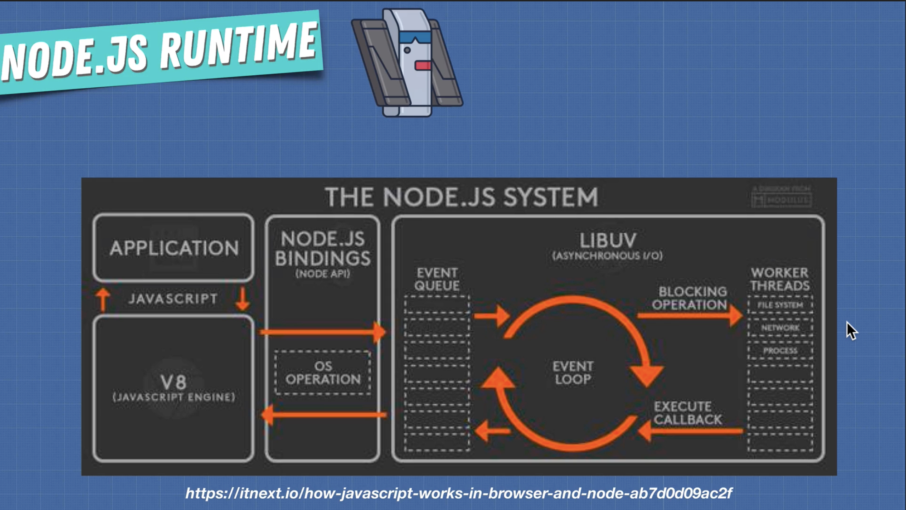

# Asynchronous JavaScript – Promises, Event Loop & Multithreading

## Table of Contents

- [1. Asynchronous JavaScript Overview](#1-asynchronous-javascript-overview)
- [2. Promises](#2-promises)
  - [2.1 What Is a Promise?](#21-what-is-a-promise)
  - [2.2 Promise States](#22-promise-states)
  - [2.3 `.then()`, `.catch()`, and `.finally()`](#23-then-catch-and-finally)
  - [2.4 Basic Promise Example](#24-basic-promise-example)
  - [2.5 Async / Await](#25-async--await)
- [3. Microtask Queue (Job Queue) vs Callback Queue](#3-microtask-queue-job-queue-vs-callback-queue)
- [4. Running Promises in Parallel, Sequence & Race](#4-running-promises-in-parallel-sequence--race)
- [5. `Promise.allSettled()`](#5-promiseallsettled)
- [6. Threads, Concurrency & Parallelism in JavaScript](#6-threads-concurrency--parallelism-in-javascript)
  - [6.1 Browser Web Workers](#61-browser-web-workers)
  - [6.2 Node.js `worker_threads`](#62-nodejs-worker_threads)
- [7. Best-Practice Takeaways](#7-bestpractice-takeaways)

---

## 1. Asynchronous JavaScript Overview

JavaScript is **single-threaded**—it has **one call stack**, so only one piece of code runs at a time (synchronous execution). Long-running operations (AJAX, timers, file I/O) would block the UI if executed synchronously.

Browsers and Node.js expose **asynchronous APIs** (timers, `fetch`, I/O, Web Workers, etc.). These APIs run work outside the main thread and notify JavaScript **later** via callbacks, promises, or events. The **event loop** coordinates:

1. **Call Stack** – Executes synchronous code.
2. **Web APIs / libuv** – Handle timers, I/O, etc.
3. **Queues** –
   - **Microtask queue (Job queue)** – Promise callbacks, `queueMicrotask`.
   - **Callback queue (Macrotask)** – `setTimeout`, DOM events, etc.
4. **Event Loop** – When the stack is empty, runs all microtasks first, then one callback task.

---

## 2. Promises

### 2.1 What Is a Promise?

A **Promise** is an object representing the eventual result (or failure) of an asynchronous operation. Think of it as a _placeholder_ for a value that will be known in the future.

```txt
Promise → "I promise I’ll give you X later."
```

Promises let you:

- Attach success / failure handlers _now_ and run them _later_.
- Chain asynchronous steps without _callback hell_.

### 2.2 Promise States

| State         | Meaning                                      |
| ------------- | -------------------------------------------- |
| **pending**   | Operation not finished yet                   |
| **fulfilled** | Operation completed successfully (`resolve`) |
| **rejected**  | Operation failed (`reject`)                  |

A promise is _settled_ when it is either fulfilled or rejected.

### 2.3 `.then()`, `.catch()`, and `.finally()`

| Method                             | Runs when…                               | Returns                               |
| ---------------------------------- | ---------------------------------------- | ------------------------------------- |
| `.then(onFulfilled?, onRejected?)` | Promise fulfills (or optional reject cb) | _new_ promise                         |
| `.catch(onRejected)`               | Promise rejects                          | _new_ promise                         |
| `.finally(onSettled)`              | Promise settles (fulfill **or** reject)  | _new_ promise (passes through result) |

Chaining works because each method returns a _new_ promise.

### 2.4 Basic Promise Example

```js
const getData = () =>
	new Promise((resolve, reject) => {
		setTimeout(() => {
			const ok = Math.random() > 0.3;
			ok ? resolve("🎉 Data received") : reject(new Error("💥 Failure"));
		}, 1000);
	});

getData()
	.then(console.log) // runs if fulfilled
	.catch(console.error) // runs if rejected
	.finally(() => console.log("Done")); // always runs
```

### 2.5 Async / Await

`async`/`await` is syntactic sugar over promises that looks synchronous:

```js
async function fetchUser() {
	try {
		const res = await fetch("/api/user");
		const data = await res.json();
		return data;
	} catch (err) {
		console.error(err);
	} finally {
		console.log("request finished");
	}
}
```

- `await` pauses **only** inside the async function until the promise settles.
- The surrounding function still returns a _promise_.

---

## 3. Microtask Queue (Job Queue) vs Callback Queue

- **Microtasks**: promise callbacks (`.then`, `.catch`, `.finally`, `queueMicrotask`, Mutation Observer).
  _Higher priority_ – executed _immediately_ after current stack is empty **before** any macrotask.
- **Callback queue (Macrotasks)**: timers (`setTimeout`/`setInterval`), I/O, UI events.

```js
console.log("1");

setTimeout(() => console.log("timeout"), 0); // macrotask
Promise.resolve().then(() => console.log("promise")); // microtask

console.log("2");
// Output → 1 2 promise timeout
```

Because the event loop empties the microtask queue before processing the next macrotask, the promise callback runs before the `setTimeout` even with a 0 ms delay.

---

## 4. Running Promises in Parallel, Sequence & Race

```js
const promisify = (item, delay) =>
	new Promise((res) => setTimeout(() => res(item), delay));

const a = () => promisify("a", 100);
const b = () => promisify("b", 5000);
const c = () => promisify("c", 3000);

// Parallel – all run together
async function parallel() {
	const [x, y, z] = await Promise.all([a(), b(), c()]);
	return `parallel: ${x} ${y} ${z}`;
}

// Sequential – wait one-by-one
async function sequence() {
	const x = await a();
	const y = await b();
	const z = await c();
	return `sequence: ${x} ${y} ${z}`;
}

// Race – first settled wins
async function race() {
	const first = await Promise.race([a(), b(), c()]);
	return `race: ${first}`;
}

sequence().then(console.log);
parallel().then(console.log);
race().then(console.log);
```

---

## 5. `Promise.allSettled()`

Waits until **every** promise settles (fulfilled **or** rejected) and returns an array of result objects.

```js
const promise1 = Promise.resolve(3);
const promise2 = new Promise((_, reject) => setTimeout(reject, 100, "fail"));

Promise.allSettled([promise1, promise2]).then((results) =>
	results.forEach((r) => console.log(r.status))
);
// → fulfilled, rejected
```

Useful for showing partial results or logging all errors without short-circuiting like `Promise.all`.

---

## 6. Threads, Concurrency & Parallelism in JavaScript

JavaScript engines (V8, SpiderMonkey) execute JS on **one main thread**. Concurrency comes from:

- **Asynchronous APIs** (I/O, timers, network) handled by browser threads or Node’s **libuv** thread pool.
- **Event loop** multiplexes results back onto the single JS thread.



### 6.1 Browser Web Workers

Web Workers run JS in **background threads** with their own event loop.

```js
// main.js
const worker = new Worker("worker.js");
worker.postMessage(42);
worker.onmessage = ({ data }) => console.log("Result:", data);

// worker.js (runs off main thread)
self.onmessage = ({ data }) => {
	const result = heavyCompute(data);
	self.postMessage(result);
};
```

_Limits_: no DOM access, communicate via `postMessage`, copy or transfer data (or `SharedArrayBuffer`). Great for image processing, data parsing, ML, etc.

### 6.2 Node.js `worker_threads`

Node 12+ provides real threads:

```js
// main.mjs
import { Worker } from "node:worker_threads";
new Worker("./worker.mjs", { workerData: 1000000000 });
```

Ideal for CPU-bound tasks (hashing, compression). For I/O-bound tasks, Node’s default async APIs are usually sufficient.

**Key Terms**
| Term | Meaning |
|-----------------|---------|
| **Concurrency** | Ability to start tasks, pause, start others (appears simultaneous) |
| **Parallelism** | Literally run tasks at the **same time** on multiple CPU cores |
| **Thread** | Smallest unit of CPU scheduling |

---

## 7. Best-Practice Takeaways

1. **Prefer promises / async-await** over callbacks—cleaner error handling.
2. Always **handle rejections** (`.catch` or `try/catch`) to avoid “Unhandled Promise Rejection”.
3. Remember **microtasks > macrotasks** when debugging execution order.
4. Use **`Promise.all`** for parallel awaits, **`allSettled`** for fault-tolerant waits, **`race`** / **`any`** for first-in wins.
5. Offload heavy CPU work with **Web Workers** (browser) or **worker_threads** (Node) to keep the UI/main thread responsive.
6. Keep the main thread fast: avoid long synchronous loops, prefer streaming & chunking data.

_Mastering asynchronous patterns and the browser/Node event loop lets you write non-blocking, performant JavaScript applications._
