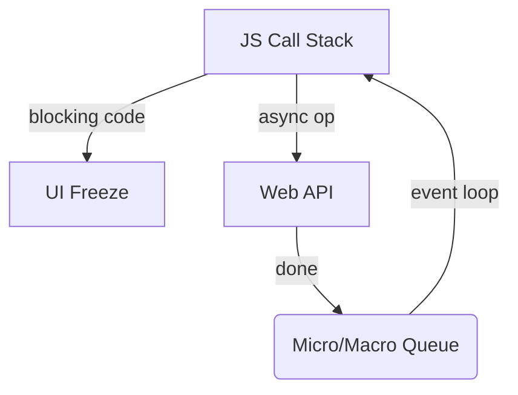

# Ultra-Deep Asynchronous JavaScript Guide (ES2025)

## Table of Contents

1. [Synchronous vs Asynchronous JavaScript](#1-synchronous-vs-asynchronous-javascript)
2. [Promises – The Core Abstraction](#2-promises--the-core-abstraction)
   2.1 [Anatomy & State Machine](#21-anatomy--state-machine) │ 2.2 [Chaining & Propagation](#22-chaining--propagation) │ 2.3 [Common Pitfalls](#23-common-pitfalls)
3. [Async / Await – Syntactic Sugar](#3-async--await--syntactic-sugar)
   3.1 [Sequential vs Parallel Awaits](#31-sequential-vs-parallel-awaits) │ 3.2 [Graceful Cancellation (`AbortController`)](#32-graceful-cancellation)
4. [Event Loop Internals](#4-event-loop-internals)
   4.1 [Macro- vs Micro-Tasks](#41-macro--vs-micro--tasks) │ 4.2 [Render & Reflow Phases](#42-render--reflow-phases)
5. [Promise Combinators & Concurrency Patterns](#5-promise-combinators--concurrency-patterns)
6. [Advanced Promise Utilities](#6-advanced-promise-utilities)
   6.1 [`Promise.withResolvers()` ES2025](#61-promisewithresolvers) │ 6.2 [Timeout & Retry Wrappers](#62-timeout--retry-wrappers)
7. [Threads, Workers & Shared Memory](#7-threads-workers--shared-memory)
   7.1 [Browser Workers](#71-browser-workers) │ 7.2 [Node `worker_threads` vs Cluster](#72-node-worker_threads-vs-cluster) │ 7.3 [SharedArrayBuffer & Atomics](#73-sharedarraybuffer--atomics)
8. [Performance & Best-Practice Checklist](#8-performance--bestpractice-checklist)

---

## 1. Synchronous vs Asynchronous JavaScript

- **Single Thread** ➜ One call-stack executes one frame at a time.
- **Blocking Operations** lock the UI/server → Bad UX.
- **Asynchronous APIs** move work off the main thread (network, timers, I/O). When done, they schedule callbacks/promise-jobs back onto the queue. The **event loop** orchestrates this hand-off.



---

## 2. Promises – The Core Abstraction

### 2.1 Anatomy & State Machine<a id="21-anatomy--state-machine"></a>

```js
const p = new Promise((resolve, reject) => {
	// async work
	if (success) resolve(value);
	else reject(error);
});
```

States: **pending → fulfilled | rejected** (irrevocable).

### 2.2 Chaining & Propagation<a id="22-chaining--propagation"></a>

```js
fetchJSON("/user")
	.then((u) => fetchJSON(`/posts?user=${u.id}`)) // auto-unwraps promise
	.then((posts) => posts.filter((p) => p.published))
	.catch(handleNetworkError) // bubbled reject
	.finally(() => log("done"));
```

Rules:

1. Each handler runs **async** (microtask).
2. Return value becomes next link’s resolution.
3. Throwing inside handler triggers rejection downstream.

### 2.3 Common Pitfalls<a id="23-common-pitfalls"></a>

| Pitfall                           | Fix                         |
| --------------------------------- | --------------------------- |
| Forgotten `return` inside `.then` | `return fetch(...)`         |
| Mixing callbacks + promises       | Choose one style            |
| Unhandled rejections              | global listeners + `.catch` |

```js
window.addEventListener("unhandledrejection", (e) => sendToTelemetry(e));
```

---

## 3. Async / Await – Syntactic Sugar

```js
async function getProfile(id) {
	const [user, posts] = await Promise.all([
		fetchJSON(`/user/${id}`),
		fetchJSON(`/posts?user=${id}`),
	]);
	return { ...user, posts };
}
```

- `async` ⇒ always returns a promise.
- `await` ⇒ pauses **inside** the async function only.

### 3.1 Sequential vs Parallel Awaits<a id="31-sequential-vs-parallel-awaits"></a>

Use `Promise.all` for independent tasks; sequential when order/data-dependency matters.

### 3.2 Graceful Cancellation (`AbortController`)<a id="32-graceful-cancellation"></a>

```js
const ctrl = new AbortController();
fetch(url, { signal: ctrl.signal });
ctrl.abort(); // reject promise with DOMException
```

Wrap long tasks with a race against a timeout:

```js
const timeout = (ms) => new Promise((_, r) => setTimeout(() => r("T/O"), ms));
await Promise.race([fetch(url), timeout(5000)]);
```

---

## 4. Event Loop Internals

### 4.1 Macro- vs Micro-Tasks<a id="41-macro--vs-micro--tasks"></a>

- **Microtasks**: Promise reactions, `queueMicrotask`, `MutationObserver` → run after stack, before paint.
- **Macrotasks**: `setTimeout`, I/O, UI events, `MessageChannel` → one per loop tick.

```js
console.log(1);
setTimeout(() => console.log("macro"), 0);
queueMicrotask(() => console.log("micro"));
console.log(2); // → 1 2 micro macro
```

### 4.2 Render & Reflow Phases<a id="42-render--reflow-phases"></a>

Browser performs layout/paint between macrotasks. Heavy microtask loops can starve rendering; break work with `await 0` or `setTimeout(fn,0)`.

---

## 5. Promise Combinators & Concurrency Patterns

| Combinator           | Settles When                          | Outcome                     |
| -------------------- | ------------------------------------- | --------------------------- | -------- |
| `Promise.all`        | **All fulfilled** else first reject   | Array results / first error |
| `Promise.allSettled` | All settled                           | Array `{status,value        | reason}` |
| `Promise.race`       | First settled (fulfill **or** reject) | Result / error              |
| `Promise.any`        | First **fulfilled**                   | Value / `AggregateError`    |

Use-cases:

- **all**: load multiple resources in parallel.
- **any**: fastest CDN mirror.
- **allSettled**: show results even if some fail.
- **race**: timeout races.

---

## 6. Advanced Promise Utilities

### 6.1 `Promise.withResolvers()` (ES2025)<a id="61-promisewithresolvers"></a>

Provides `{promise, resolve, reject}` without manual constructor.

```js
const { promise, resolve } = Promise.withResolvers();
setTimeout(() => resolve("done"), 1000);
await promise;
```

### 6.2 Timeout & Retry Wrappers<a id="62-timeout--retry-wrappers"></a>

```js
const withTimeout = (p, ms) =>
	Promise.race([
		p,
		new Promise((_, r) => setTimeout(() => r(new Error("timeout")), ms)),
	]);
```

---

## 7. Threads, Workers & Shared Memory

### 7.1 Browser Workers<a id="71-browser-workers"></a>

- **Dedicated Worker**: one-to-main page.
- **Shared Worker**: multiple pages share.
- **Service Worker**: network proxy layer (offline, PWA).

Transfer large data efficiently:

```js
// zero-copy transfer
worker.postMessage(arrayBuffer, [arrayBuffer]);
```

Use **SharedArrayBuffer + Atomics** for true shared memory (requires COOP/COEP headers).

### 7.2 Node `worker_threads` vs Cluster<a id="72-node-worker_threads-vs-cluster"></a>

| Feature      | `worker_threads`                        | Cluster                          |
| ------------ | --------------------------------------- | -------------------------------- |
| Isolation    | Same process, separate V8 instances     | Separate processes               |
| Overhead     | Low (shared memory)                     | Higher (IPC)                     |
| Use-case     | CPU-bound tasks (hashing, image resize) | Scaling HTTP server across cores |
| Memory share | `SharedArrayBuffer`, `MessagePort`      | copy/serialize via IPC           |

> **Rule of thumb**: Use **cluster** for request load-balancing; use **worker_threads** for heavy CPU work inside one server.

### 7.3 SharedArrayBuffer & Atomics<a id="73-sharedarraybuffer--atomics"></a>

```js
// main
const sab = new SharedArrayBuffer(Int32Array.BYTES_PER_ELEMENT * 1024);
const view = new Int32Array(sab);
worker.postMessage(sab, [sab]);

// worker
self.onmessage = ({ data }) => {
	const view = new Int32Array(data);
	Atomics.add(view, 0, 1); // thread-safe increment
	postMessage(Atomics.load(view, 0));
};
```

Security: document **must** be `crossOriginIsolated`.

---

## 8. Performance & Best-Practice Checklist

1. **Batch DOM mutations** inside a single macrotask.
2. **Prefer micro-queue** (`queueMicrotask`) for small follow-ups; but avoid long microtask loops that starve paint.
3. **Parallelize independent awaits** with `Promise.all` for speed.
4. **Guard every promise** with `.catch` or top-level `unhandledrejection`.
5. **Time-out & cancel** fetches using `AbortController`.
6. **Throttle request rate** to APIs; use `p-limit`, `Bottleneck` libs.
7. **Offload heavy CPU** to Web Worker / `worker_threads`; keep UI thread < 50 ms per frame.
8. **Avoid sharing mutable objects** between threads; prefer transferable ArrayBuffers or shared memory with Atomics.
9. **Profile** with Chrome DevTools → Performance panel, Node’s `--inspect`.
10. **Document invariants** of async flows; add comments where order matters.

---

_Grasping these advanced asynchronous patterns, queue semantics, and multithreading options equips you to build responsive UIs, resilient servers, and compute-intensive apps that fully leverage modern JavaScript runtimes._
